# 🏥 HealthcareTransport Microservices Platform

[](https://dotnet.microsoft.com/)
[](https://www.docker.com/)
[](https://kubernetes.io/)
[](https://www.rabbitmq.com/)
[](https://grpc.io/)
[](https://www.microsoft.com/sql-server)

> Enterprise-grade **Non-Emergency Medical Transportation (NEMT)** system built with Cloud-Native architecture, demonstrating microservices patterns, event-driven design, and container orchestration.

---

## 🏗️ Architecture

```mermaid
flowchart TB
    subgraph INTERNET["🌐 Internet"]
        CLIENT[("👤 Client")]
    end

    subgraph K8S["☸️ Kubernetes Cluster"]
        
        subgraph GATEWAY["API Gateway Layer"]
            INGRESS["🚪 NGINX Ingress Controller"]
        end

        subgraph SERVICES["Microservices Layer"]
            subgraph MS["👤 Member Service"]
                MS_API["REST API"]
                MS_GRPC["gRPC Server"]
                MS_PUB["Event Publisher"]
            end
            
            subgraph TS["🚑 Trip Service"]
                TS_API["REST API"]
                TS_GRPC["gRPC Client"]
                TS_SUB["Event Subscriber"]
            end
        end

        subgraph MESSAGING["Messaging Layer"]
            RMQ[("🐰 RabbitMQ<br/>Event Bus")]
        end

        subgraph DATA["Data Layer"]
            SQL[("🗄️ SQL Server<br/>Persistent Storage")]
        end

    end

    CLIENT --> INGRESS
    INGRESS --> MS_API
    INGRESS --> TS_API
    
    TS_GRPC -->|"Sync: GetMembers()"| MS_GRPC
    MS_PUB -->|"Async: MemberCreated"| RMQ
    RMQ -->|"Async: MemberCreated"| TS_SUB
    
    MS --> SQL
    TS --> SQL
```



## 🔄 Communication Patterns


---

## 🎯 System Design

### Design Principles

| Principle | Implementation |
|:----------|:---------------|
| **Single Responsibility** | Each service owns its domain and data |
| **Loose Coupling** | Services communicate via events and contracts |
| **High Cohesion** | Related functionality grouped within services |
| **Database per Service** | Dedicated persistence layer per microservice |
| **API Gateway Pattern** | Unified entry point via Ingress Controller |
| **Event-Driven Architecture** | Asynchronous communication via RabbitMQ |

### Patterns Implemented

| Pattern | Technology | Purpose |
|:--------|:-----------|:--------|
| API Gateway | NGINX Ingress | Single entry point, routing, load balancing |
| Service Discovery | Kubernetes DNS | Automatic service resolution |
| Pub/Sub Messaging | RabbitMQ | Asynchronous event-driven communication |
| Synchronous RPC | gRPC | High-performance inter-service calls |
| Database per Service | SQL Server | Data isolation and independence |
| Repository Pattern | EF Core | Data access abstraction |
| DTO Pattern | AutoMapper | Data transfer between layers |

---

## 🛠️ Technology Stack

| Layer | Technology | Version |
|:------|:-----------|:--------|
| **Runtime** | .NET | 8.0 |
| **API Framework** | ASP.NET Core Web API | 8.0 |
| **Inter-Service Sync** | gRPC | Latest |
| **Inter-Service Async** | RabbitMQ | 3.x |
| **ORM** | Entity Framework Core | 8.0 |
| **Database** | SQL Server | 2019 |
| **Containerization** | Docker | Latest |
| **Orchestration** | Kubernetes | 1.28+ |
| **API Gateway** | NGINX Ingress | Latest |
| **Object Mapping** | AutoMapper | 12.x |

---

## 🏥 Services

### 👤 Member Service

Manages healthcare member enrollment and demographics.

| Aspect | Details |
|:-------|:--------|
| **Domain** | Member/Patient Management |
| **Database** | Dedicated SQL Server |
| **API Type** | REST + gRPC Server |
| **Events** | Publishes `MemberCreatedEvent` |

**Endpoints:**

| Method | Endpoint | Description |
|:-------|:---------|:------------|
| `GET` | `/api/members` | Get all members |
| `GET` | `/api/members/{id}` | Get member by ID |
| `POST` | `/api/members` | Create new member |

### 🚑 Trip Service

Manages NEMT trip scheduling and coordination.

| Aspect | Details |
|:-------|:--------|
| **Domain** | Transportation Management |
| **Database** | Dedicated SQL Server |
| **API Type** | REST + gRPC Client |
| **Events** | Subscribes to `MemberCreatedEvent` |

**Endpoints:**

| Method | Endpoint | Description |
|:-------|:---------|:------------|
| `GET` | `/api/trips/members` | Get all synced members |
| `GET` | `/api/trips/members/{id}` | Get member by ID |
| `GET` | `/api/trips/members/{id}/trips` | Get member's trips |
| `POST` | `/api/trips/members/{id}/trips` | Create trip |

---

## 📦 Infrastructure

### Kubernetes Resources


### Service Ports

| Service | ClusterIP Port | NodePort | Protocol |
|:--------|:---------------|:---------|:---------|
| Member Service | 80, 666 | 30111 | HTTP, gRPC |
| Trip Service | 80 | 30002 | HTTP |
| SQL Server | 1433 | - | TDS |
| RabbitMQ | 5672, 15672 | 30003 | AMQP, HTTP |

---

## 🚀 Getting Started

### Prerequisites

- [Docker Desktop](https://www.docker.com/products/docker-desktop/) with Kubernetes enabled
- [.NET 8 SDK](https://dotnet.microsoft.com/download/dotnet/8.0)
- [kubectl](https://kubernetes.io/docs/tasks/tools/)

### Quick Start with Docker Compose

```bash
# Clone repository
git clone https://github.com/yourusername/healthcare-transport-microservices.git
cd healthcare-transport-microservices

# Start all services
docker-compose up --build
```

**Access Points:**

| Service | URL |
|:--------|:----|
| Member Service | http://localhost:5279/api/members |
| Trip Service | http://localhost:6000/api/t/Members |
| RabbitMQ Dashboard | http://localhost:15672/#/ |

### Kubernetes Deployment

```bash
# Create SQL Server secret
kubectl create secret generic mssql-secret \
  --from-literal=SA_PASSWORD="pa55w0rd!"

# Deploy all resources
kubectl apply -f K8S/

# Verify deployment
kubectl get all
```

**Configure hosts file:**

```bash
# Add to /etc/hosts (Linux/Mac) or C:\Windows\System32\drivers\etc\hosts (Windows)
127.0.0.1 careflow.com
```

**Access Points:**

| Service | URL |
|:--------|:----|
| Member Service | http://careflow.com/api/members/ |
| Trip Service | http://careflow.com/api/t/members |

---

## 📖 API Examples

### Create Member

```bash
curl -X POST http://careflow.com/api/members/ \
  -H "Content-Type: application/json" \
  -d '{
    "memberNumber": "MBR-2024-001",
    "firstName": "John",
    "lastName": "Doe"
  }'
```

### Create Trip

```bash
curl -X POST http://careflow.com/api/t/members/1/trips \
  -H "Content-Type: application/json" \
  -d '{
    "scheduledPickupTime": "2024-12-15T09:00:00Z",
    "pickupAddress": "123 Home St, City, ST 12345",
    "dropoffAddress": "456 Medical Center Dr, City, ST 12345"
  }'
```

---

## 📂 Project Structure

```
healthcare-transport-microservices/
│
├── 📁 MemberService/
│   ├── 📁 Controllers/
│   ├── 📁 Data/
│   ├── 📁 Dtos/
│   ├── 📁 Models/
│   ├── 📁 Profiles/
│   ├── 📁 AsyncDataServices/
│   ├── 📁 SyncDataServices/Grpc/
│   ├── 📄 Program.cs
│   └── 🐳 Dockerfile
│
├── 📁 TripService/
│   ├── 📁 Controllers/
│   ├── 📁 Data/
│   ├── 📁 Dtos/
│   ├── 📁 Models/
│   ├── 📁 EventProcessing/
│   ├── 📁 AsyncDataServices/
│   ├── 📁 SyncDataServices/Grpc/
│   ├── 📄 Program.cs
│   └── 🐳 Dockerfile
│
├── 📁 K8S/
│   ├── 📄 members-depl.yaml
│   ├── 📄 trips-depl.yaml
│   ├── 📄 mssql-depl.yaml
│   ├── 📄 rabbitmq-depl.yaml
│   ├── 📄 local-pvc.yaml
│   └── 📄 ingress-srv.yaml
│
├── 🐳 docker-compose.yml
└── 📄 README.md
```

---

## 🗺️ Roadmap


### Version Details

| Version | Status | Features |
|:--------|:-------|:---------|
| **v1.0** | ✅ Complete | REST APIs, Docker, K8s, RabbitMQ, gRPC |
| **v2.0** | 🔄 Planned | Kafka, OpenTelemetry, Prometheus, Grafana |
| **v3.0** | 📋 Planned | Azure AKS, Terraform, CI/CD |
| **v4.0** | 📋 Planned | HIPAA, OAuth 2.0, CQRS, Saga Pattern |

---

## 🔧 Commands Reference

| Task | Command |
|:-----|:--------|
| Start (Docker) | `docker-compose up --build` |
| Stop (Docker) | `docker-compose down` |
| Logs (Docker) | `docker-compose logs -f` |
| Deploy (K8s) | `kubectl apply -f K8S/` |
| Status (K8s) | `kubectl get all` |
| Logs (K8s) | `kubectl logs -f <pod-name>` |
| Delete (K8s) | `kubectl delete -f K8S/` |

---

## 👤 Author

**Munijoshna Pogala**

[](https://github.com/joshnajo)
[](www.linkedin.com/in/munijoshna-pogala-491856158)

---

<p align="center">
  <b>Built with ❤️ for Healthcare Technology</b>
</p>
```
